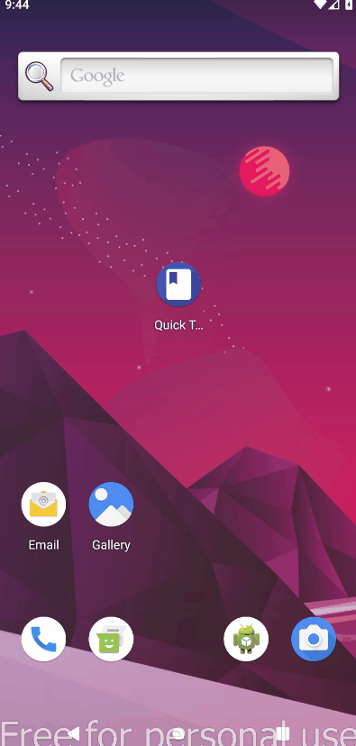

<h1 align="center">Trivia Game App_ Redux</h1>

  <h3>
    <a href="https://github.com/NureddinHasanBikec/Trivia_Game_App">
      Project Source
    </a>
 
  </h3>

<!-- TABLE OF CONTENTS -->

## Table of Contents

- [Overview](#overview)
- [Built With](#built-with)
- [Features](#features)
- [How to use](#how-to-use)
- [Acknowledgements](#acknowledgements)
- [Contact](#contact)

<!-- OVERVIEW -->
    
  
  |  Game   | Icon | 
  |-------------------|:--------: |
  | |  |

  ### Built With

<!-- This section should list any major frameworks that you built your project using. Here are a few examples.-->

- [React-native](https://reactnative.dev/)

## Features

 This app comprises use of Stack Navigation, Redux and RESTFUL Web APIs

-  The app has a new icon made with Android Assets Studio.
-  The user takes the first step for a new quiz by clicking the start button.
- When the user selects a topic for the quiz, the countdown starts at 5 seconds,  after 5 seconds the quiz starts automatically.
- When open quiz page, as well as countdown start from 40 secs
- User must answer questions the mentioned duration. End of duration or in case of finish all questions, the page directed to result page which shown score.

### How to Use

To use this application, the packages for navigation, redux, Countdown Circle Timer, Modal, Vector Icons and APIs (axios) should be installed prior to running the app. From your command line:

<pre><code>npm install @react-navigation/native
For expo :
expo install react-native-gesture-handler react-native-reanimated react-native-screens react-native-safe-area-context @react-native-community/masked-view
For bare React-native:
npm install react-native-reanimated react-native-gesture-handler react-native-screens react-native-safe-area-context @react-native-community/masked-view

npx pod-install ios(for IOS)

npm install @react-navigation/stack

npm install axios

npm install redux react-redux

npm install react-countdown-circle-timer

npm install react-native-modal

npm install react-native-vector-icons
</code></pre>

Note: You can use any fonts with GoogleFonts

## Acknowledgements

<!-- This section should list any articles or add-ons/plugins that helps you to complete the project. This is optional but it will help you in the future. For exmpale -->

-  <a href="https://opentdb.com/" rel="nofollow">Source of APIs</a>

## Contact

- GitHub [NureddinHasanBikec](https://github.com/NureddinHasanBikec)
- Linkedin [@Nureddin Hasan Bikeç](https://www.linkedin.com/in/nureddin-hasan-bikeç)
